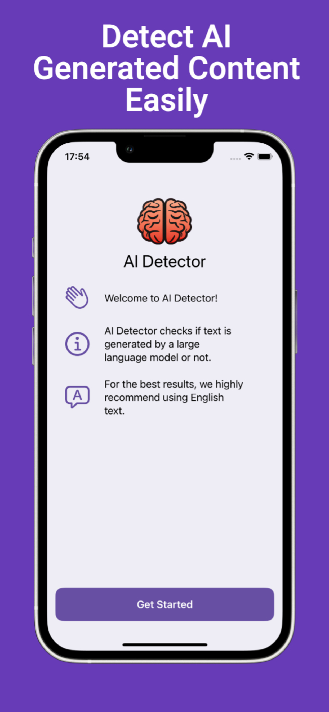

# GPT Detector SwiftUI

SwiftUI implementation of [GPT Detector](https://github.com/cem256/GPT-Detector). Calculates the perplexity and burstiness of a given text to determine whether it was generated by a large language model or not.

## Preview

    
    
    
    

## Features

- Analyze plain text.
- Analyze text by selecting a photo from the photo library using OCR.
- Analyze text by utilizing the phone's camera with OCR.

## How results are calculated?

- Large language models like ChatGPT typically generate text that is less complex and random compared to human-created content. The level of randomness and complexity can be analyzed to differentiate between AI-generated and human-created content.

## What are the limitations of the GPT Detector?

- Current version of the GPT Detector is optimized for texts written in English. So, using text in other languages may result in inaccurate results.
- Texts written by children or non-native English speakers may be misclassified because they often produce text that is less random and complex.
- As AI models advance, they become better at generating text that looks like human writing which affects the reliability of the GPT Detector. Therefore, it's not advised to solely rely on the detector's results for decision-making.

## Architecture

Developed with [MVVM](https://en.wikipedia.org/wiki/Model%E2%80%93view%E2%80%93viewmodel)

## Project Structure

- "Core" folder contains application-agnostic code that can be reused in other projects.
- "Feature" folder represents the app's feature set.
- "App" folder holds files specific to this particular application.

## Contributing
### Translation
You can help translate this app to other languages!

1. Fork this repository
2. Choose one
    - Add missing translations in existing languages
   - Improve translations in existing languages: Update desired languages `Localizable.strings` in [GPTDetectorSwiftUI/App/L10n][l10n]
   - Add new languages:
     1. Open the settings for your Xcode project.
     2. Look for the “Localizations” section. It may be under the “Info”
     3. Click the “+” icon then choose the language you want to add support for. This will create a new `Localizable.strings` in [GPTDetectorSwiftUI/App/L10n][l10n]
     4. Add the translations for each key-value pair.
3. Run the app
   1. Make sure you have this app once.
4. Open a pull request

[l10n]: https://github.com/cem256/GPT-Detector-iOS/tree/master/GPTDetectorSwiftUI/App/L10n

## Packages

- Dependency Injection
  - [Factory](https://github.com/hmlongco/Factory)
- Image Cropper
  - [TOCropViewController](https://github.com/TimOliver/TOCropViewController)
- Resource Generator
  - [R.swift](https://github.com/mac-cain13/R.swift)
